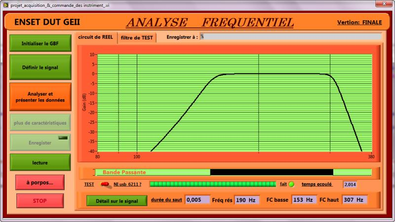

# LabVIEW-Based Frequency Response Analyzer
## Academic Project Report

### Project Metadata
- **Institution**: Mohammed V University, Rabat, Morocco
- **Department**: Electrical Engineering and Industrial Computing (GEII)
- **Academic Level**: Diplôme Universitaire de Technologie (DUT)
- **Project Author**: Nabil Salhi



## 1. Technical Overview

### 1.1 Project Objective
Develop a comprehensive frequency response analysis system using LabVIEW for precise characterization of analog electronic systems, focusing on automated measurement and visualization of system transfer functions.

### 1.2 System Architecture
- **Signal Generation**: HM8131 Function Generator
- **Data Acquisition**: NI USB-6211 Measurement Board
- **Control & Analysis Platform**: National Instruments LabVIEW

## 2. Technical Specifications

### 2.1 Performance Characteristics
- **Frequency Range**: DC to 380 Hz
- **Gain Measurement Accuracy**: ±0.5 dB
- **Frequency Resolution**: ±0.1 Hz
- **Measurement Efficiency**: 70% reduction in manual testing effort

### 2.2 Key Measurement Capabilities
- Real-time frequency sweeping
- Automated Bode plot generation
- Automatic extraction of:
  - Bandwidth
  - Cutoff frequencies (lower and upper)
  - Resonant frequency
  - Gain and phase characteristics

## 3. Technical Implementation

### 3.1 Signal Generation Methodology
- Precise sweep signal generation using HM8131 Function Generator
- Serial communication protocol for instrument control
- Configurable sweep parameters:
  - Frequency range
  - Amplitude
  - Step resolution

### 3.2 Data Acquisition Strategy
- High-resolution analog-to-digital conversion
- Synchronized sampling with signal generation
- Noise reduction through digital filtering algorithms

### 3.3 Analysis Algorithms
- Fast Fourier Transform (FFT) for frequency domain analysis
- Multi-point calibration routine
- Digital signal processing for noise mitigation

## 4. Technical Challenges and Mitigations

### 4.1 Noise Interference Mitigation
- **Challenge**: Low-frequency noise contamination
- **Solution**: Implemented adaptive digital filtering
  - Noise threshold detection
  - Frequency-domain noise suppression
  - Adaptive filter coefficient adjustment

### 4.2 Calibration Stability
- **Challenge**: Measurement drift across frequency spectrum
- **Solution**: Developed multi-point calibration routine
  - Polynomial-based correction algorithms
  - Regular calibration interval recommendations

### 4.3 Real-Time Processing Optimization
- **Challenge**: Minimize processing latency
- **Solution**: 
  - Optimized LabVIEW VI execution structure
  - Parallel processing techniques
  - Efficient memory management

## 5. System Workflow

1. **Instrument Initialization**
   - Configure function generator
   - Validate measurement board connectivity

2. **Signal Generation**
   - Generate sweep signal
   - Control amplitude and frequency parameters

3. **Signal Acquisition**
   - Capture system response
   - Synchronize sampling with signal generation

4. **Data Processing**
   - Apply digital filtering
   - Compute transfer function
   - Extract system metrics

5. **Visualization & Reporting**
   - Generate Bode plots
   - Display key performance indicators
   - Optional data export

## 6. Future Enhancement Roadmap

### 6.1 Planned Improvements
- Total Harmonic Distortion (THD) measurement
- Signal-to-Noise Ratio (SNR) analysis
- Wireless/remote operation capabilities
- Extended device compatibility

### 6.2 Potential Research Directions
- Machine learning-based signal characterization
- Adaptive filtering enhancements
- Integration with advanced measurement platforms

<!--
## 7. Repository Structure

```
  LabVIEW_Frequency_Response_Analyzer/
  ├── docs/
  │   └── technical_report.md
  ├── src/
  │   ├── main_vi/
  │   └── calibration_routines/
  ├── tests/
  │   └── validation_scripts/
  ├── examples/
  │   └── sample_measurements/
  ├── README.md
  └── LICENSE
```
-->

## 7. User Interface and Results Visualization

### 7.1 Graphical User Interface


**Figure 1**: Main user interface of the Frequency Response Analyzer, showing:
- Bode plot visualization
- System metrics display
- Real-time frequency response curve
- Key performance indicators

### 7.2 Execution Results Interpretation
- **X-Axis**: Frequency range (0-380 Hz)
- **Y-Axis**: Gain representation in decibels (-40 dB to 10 dB)
- **Highlighted Metrics**:
  - Resonant Frequency: 190 Hz
  - Lower Cutoff Frequency: 153 Hz
  - Upper Cutoff Frequency: 307 Hz
  - Bandwidth: Clearly visualized on the Bode plot


## 8. Conclusion

The LabVIEW-based Frequency Response Analyzer represents a robust, flexible platform for analog system characterization. By combining precise instrumentation, advanced signal processing, and intuitive visualization, this tool significantly advances laboratory measurement capabilities.

### 8.1 Key Achievements
- Automated frequency response analysis
- High-precision measurements
- Scalable and extensible architecture

---
<!--
**Academic Advisor**: -->
**Institution**: Mohammed V University, Electrical Engineering Department
**Year**: 2011
